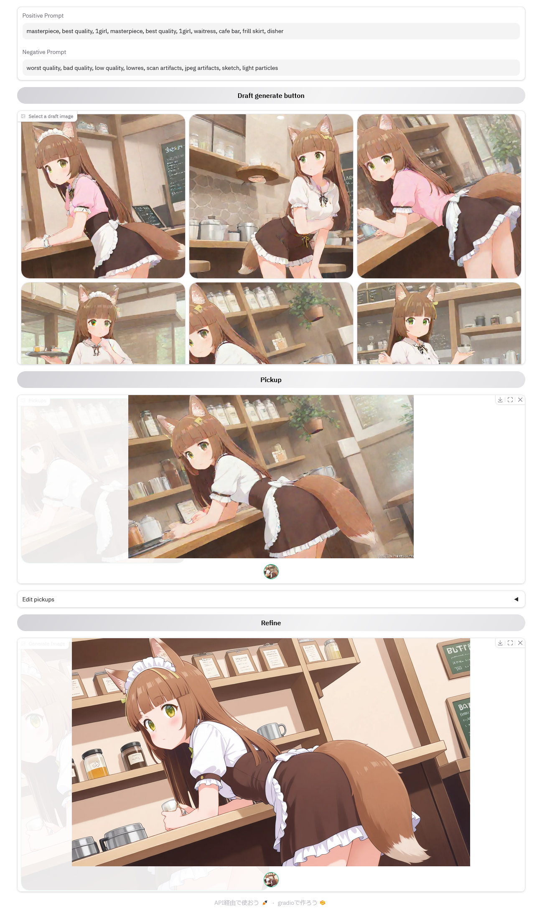

# CheckAndPick

CheckAndPickは、効率的にイメージを形にしたいクリエイター向けの画像生成ツールです。高速なドラフト生成で構図を検討し、選んだドラフトを下敷きにすることで、理想の構図を維持したまま、より精細な画像を生成できます。



## システム概要

- CheckAndPick は、ComfyUI での画像生成をサポートするツールです。ComfyUI が動作し利用できている環境が必要です。
- CheckAndPick 自身は Gradio で書かれており WEBサーバーとして起動するため、ブラウザから利用してください。
- CheckAndPick が ComfyUI API を介してローカルマシンの ComfyUI を操作し画像生成を行います。
- インストールを行えば、コマンドラインから簡単に起動できます。

## インストール

以下の手順で CheckAndPick をインストールしてください。

### pip を使用する場合

```bash
pip install CheckAndPick
```

### uv を使用する場合(オススメ)

```bash
uv tool install CheckAndPick
```

予め uv (astral-sh.uv) をインストールしておく必要があります。pip なり winget なりでインストールしておいてください。
python 仮想環境を作るので、python そのもののインストールが無くても uv だけで動くはずです。

### ソースコードからの起動

リポジトリをクローンした場合、インストール無しに uv を使って起動できます。

```bash
uv run CheckAndPick (yaml file path)
```


## 使用方法

インストール後、以下のコマンドで CheckAndPick を起動できます。

```bash
CheckAndPick (yaml file path) [-h, --host <ComfyUIのアドレスURL>]
```

### オプション

- `-h, --host`: 接続する ComfyUI のアドレスURLを指定します。
  - `http://127.0.0.1:8188/` の URL 形式で指定してください。
- `-l, --listen`: サーバーのリッスンアドレスを指定します。指定がない場合はデフォルトで `127.0.0.1` で待ち受けます。

画像生成には、各種指示を記述したYAML形式の設定ファイルが必要です。プログラム起動時にこのファイルを指定する必要があります。予め用意しておいてください。

### 設定ファイルについて

設定ファイルは YAML 形式です。任意のテキストエディタで編集してください。
`example/model_setting.yaml` にサンプルを用意しています。

```YAML
checkpoint: catTowerNoobaiXL_v15Vpred.safetensors
image-size:
  width: 1344
  height: 768
lora:
- enabled: true
  model: lora-ix-tillhi-v1.safetensors
  strength: 1
  trigger: trigger
vpred: true
lcm:
  checkpoint: catTowerNoobaiXL_v10.safetensors
  lora: lcm_lora_sdxl.safetensors
prompt:
  positive: 1girl
  negative: worst quality, bad quality, low quality, lowres, scan artifacts, jpeg artifacts, sketch, light particles
```

- checkpoint: 本番生成を行うときの SDXL モデルデータを指定します、epsilon/v-prediction どちらも使えます
- image-size: ベースとなる画像生成サイズです SDXL なので 1024x1024 を基調としてください
  - width: 画像の横幅
  - height: 画像の縦幅
- lora: 使用する LoRA の設定、キャラクター LoRA を想定しており 1つだけ設定できます
  - enabled: LoRA を使うか否か、false を設定すると LoRA 強度を 0 に設定し実質無効化します
  - model: ComfyUI に設定してある LoRA model 名、LoRA disable であっても指定する必要があり、実際に存在する LoRA ファイル名でないとエラーになります。最低 1つは LoRA を用意しておいてください
  - strength: LoRA 適用率です、1で標準、0で影響無し。2 や -1 といった値も設定可能です
  - trigger: キャラクター LoRA 等でワードに紐付けているときのトリガーワードです、この単語が prompt の頭に追加されます
- vpred: 使用する SDXL モデルが v-prediction の場合 true、epsilon の場合 false を設定します。良くわからない場合は多分 false です
- icm: ドラフト生成用の設定
  - checkpoint: ドラフト生成に使われる SDXL モデルデータ、ここでは epsilon-prediction のモデルしか使えません
  - lora: LCM LoRA のモデルファイル名 `lcm_lora_sdxl.safetensors` を想定しているので予め準備しておいてください
- prompt: プロンプトの初期値、オプショナルなのでなくても構いません。良く使うプロンプトがあったら書いておくと便利です
  - positive: ポジティブプロンプト
  - negative: ネガティブプロンプト

### 使い方

1. 生成したい画像のプロンプトを記述します
2. "Draft generate" ボタンを押すと 9枚のドラフト画が生成されます
3. ドラフト画のギャラリーで、気に入ったものをクリックして表示した状態で "Pickup" ボタンを押すことで、ピックアップギャラリーに追加します
4. 気に入るものが出るまで＆お気に入りが貯まるまで繰り返します
5. ピックアップギャラリーに画像が登録された状態で "Refine" ボタンを押すと、 精細な画像生成を開始します
6. CheckAndPick を起動したディレクトリに `outputs` ディレクトリが作られ、ピックアップしたドラフト画像と生成画像の両方がそこに置かれます

折りたたまれている "Edit pickups" を開くと、ピックアップギャラリーの操作が行えます

- Save pickup image(s)
  - 現在ピックアップギャラリーにある画像を全て `outputs` ディレクトリに保存します
- Remove
  - ピックアップギャラリーで選択表示している画像を削除します
- Clear
  - ピックアップギャラリーの画像を全て削除します
- Add Pickup Image
  - 画像ファイルをドラッグアンドドロップするとピックアップギャラリーに追加されます

### 注意点

- ピックアップしたドラフト画像を参照すると言っても全面書き直しですので、基本別の画像になります
- プロンプトの影響が主ですので、プロンプトに書いてない要素は消えたり変わったりします
- 内部的には弱めの Image2Image となっています

## ComfyUI の準備

Grodio を使用するには、ComfyUI の準備が必要です。ComfyUI の API を利用するために、事前に ComfyUI をセットアップ、起動しておいてください。

以下のカスタムノードを使っています

- ComfyUI_Comfyroll_CustomNodes
- ControlNet-LLLite-ComfyUI
  - tile model: bdsqlsz_controlllite_xl_tile_anime_beta.safetensors

### Workflow の確認

`src/Workflow/` の下にある json ファイルは ComfyUI の Workflow ファイルです。
これを ComfyUI に読み込ませたとき、赤いエラーノードが存在していなかったら OK です。
赤いエラーノードがあった場合、そこに位置するカスタムノードがインストールされていないということですので必要な物を準備してください。

Workflow が読み込めて、問題無いようなら 1回実行してみてください。無事完了したならば CheckAndPick を使う準備ができています。

## ライセンス

このプロジェクトは MIT ライセンスの下で公開されています。詳細は [LICENSE](LICENSE) ファイルを参照してください。

## 更新履歴

- Apr.26.2025 - v0.2.3
  - ハイレゾ生成ワークフローを更新
- Jan.19.2025 - v0.2.2
  - `-l, --listen` で listen network の指定ができるようにした、主に docker 内で 0.0.0.0 を指定するためのもの
- Jan.12.2025 - v0.2.1
  - `-h, --host` オプションで接続する ComfyUI のアドレスURLを指定できる機能を追加
- Jan.04.2025 - v0.2.0
  - ファーストリリース

## 作者

rerofumi

### その他

スクリーンショットやサンプル YAML に書かれている `lora-ix-tillhi-v1.safetensors` は自作キャラクターの LoRA ファイルです。
BOOTH にて無料配布しているのでご利用ください。
https://fumi2kick.booth.pm/items/4863294

